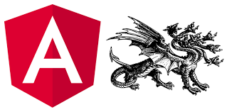

[](https://circleci.com/gh/alan-agius4/ng-mono-repo-starter)
[](https://renovateapp.com/)

<p align="center">
	
</p>

# Angular Mono Repo Starter
An Angular mono repository starter kit featuring `Jest`, `Lerna`, `Compodoc`, `scss-bundle` and `ng-packagr`.

## Features
- Flatten SCSS output into a single file to improve build time for consumers
- Supports scoped packages
- Supports secondary entries similar to Angular's Testing Modules.
- All the other features that `Jest`, `Lerna`, `Compodoc` and `ng-packagr` provide.

## The Stack
 - [Lerna](https://lernajs.io) - A tool for managing JavaScript projects with multiple packages. One of the major advantage of Lerna is semantic releases and package version syncing.
 - [Jest](https://facebook.github.io/jest) - Jest is used by Facebook to test all JavaScript code including React applications. One of Jest's philosophies is to provide an integrated "zero-configuration" experience.
 - [ng-packagr](https://github.com/dherges/ng-packagr) - Transpile and Bundle libraries to Angular Package Format.
 - [Compodoc](https://compodoc.github.io/website/guides/getting-started.html) - Compodoc is a documentation tool for Angular applications & libraries. It generates awesome static documentation.
 - [scss-bundle](https://github.com/SimplrJS/scss-bundle) - Bundles all SCSS imports into a single file

## Get Started
To get started, you need to:

1) Clone the repository
```shell
git clone https://github.com/alan-agius4/ng-mono-repo-starter.git <project_name>
```

2) Install dependencies
```
cd <project_name>
npm install
```

Note: There is a `postinstall` script that after `npm install` has finished will bootstrap the mono repo.

## Setting your project scope
It is recommanded that you use [scoped](https://docs.npmjs.com/misc/scope) npm packages. This is set to `@speedy` by default. To change it you need to modify a couple of files.

These are:
- `tsconfig.json`
- `tsconfig.build.json`
- `lerna.json`
- `jest.config.js`

## NPM Tasks

| Task       | Description                                                                           |
|------------|---------------------------------------------------------------------------------------|
| aio        | Generates a static documentation of your libraries                                    |
| bootstrap  | Install packages dependencies and bootstrap the mono repo                             |
| build      | Build all the packages inside the mono repo                                           |
| build-tools| Build the tools script that are used for building the mono repo                       |
| clean      | Clean up packages `node_modules` and `dist` folders                                   |
| test       | Run unit and integration tests                                                        |
| test-debug | Run unit and integration tests in debug mode                                          |
| test-tdd   | Run unit and integration tests in watch mode                                          |

## Testing
For this project, I chose Jest as our test framework. While Karma is probably more common for Angular testing, Karma is slower and doesn't offer some important features that Jest does.

### Using the debugger in VS Code
Debugging is one of the places where VS Code really shines over other editors. This project comes pre-configured `launch.json`. All you need to do is hit `F5` in `VS Code` and get debugging!
